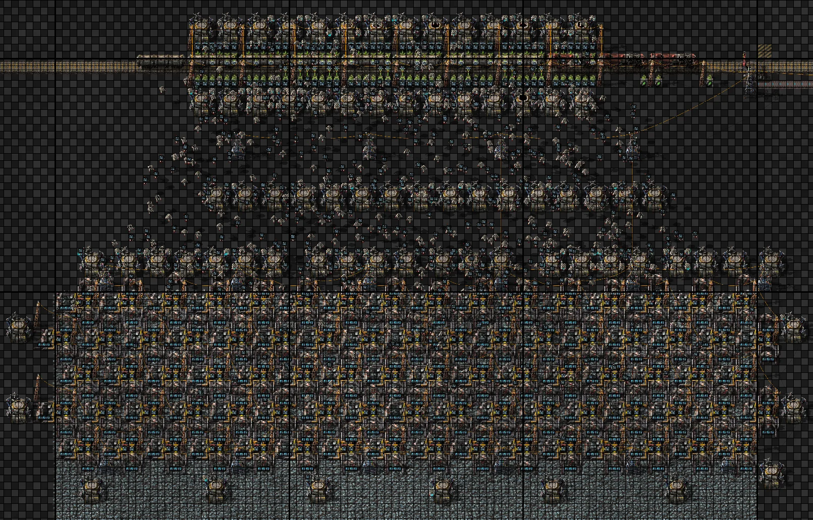
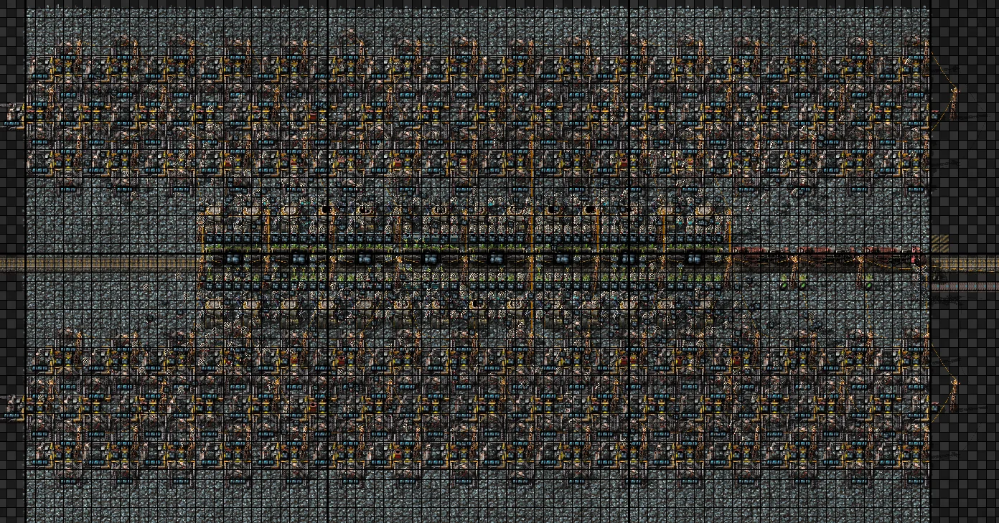
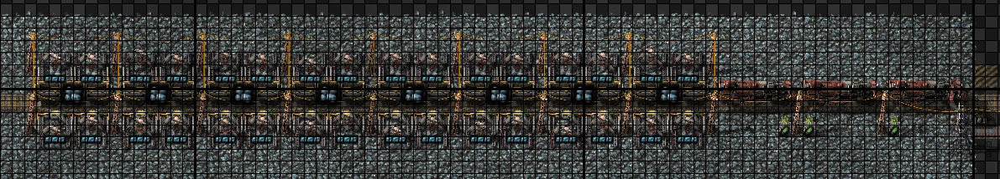
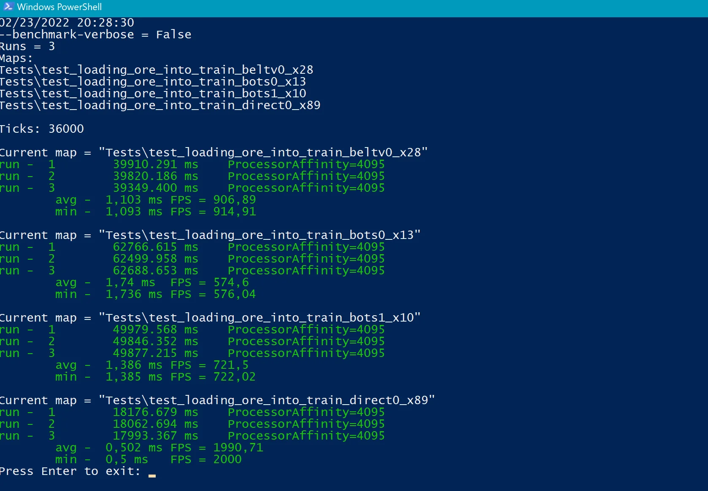

# Loading ore into the train. What's best for UPS?

Let's compare different options for loading ore.

Trains 3-8: load ore, transport ore to 1000 tiles and unload.

Ore extraction approximately 600k/min (approximately 5k spm).

MP = 20, bot speed = 10

## 1.1. Belts

Standard option for multiplayer: balancer + chests [(test_loading_ore_into_train_beltv0_x28)](https://disk.yandex.ru/d/kSFsv-aUbdd8-Q)

## 1.2. Bots (standart)

The standard option for multiplayer: a long distance to the ore [(test_loading_ore_into_train_bots0_x13)](https://disk.yandex.ru/d/KeW9j5k4qeqbyA)

## 1.3. Bots (improved version)

Have you seen this in multiplayer? I'm not [(test_loading_ore_into_train_bots1_x10)](https://disk.yandex.ru/d/qwksC2WyYOyYbg)

Reduced the number of roboports, the minimum distance to the ore.

## 1.4. Direct mining

Nothing superfluous [(test_loading_ore_into_train_direct0_x89)](https://disk.yandex.ru/d/KOUNMRFtRV3Zow)

## 2. Benchmark

Intel 10600k + ddr4-3600

36000 ticks

| First Header  | Second Header |
| ------------- | ------------- |
| Content Cell  | Content Cell  |
| Content Cell  | Content Cell  |